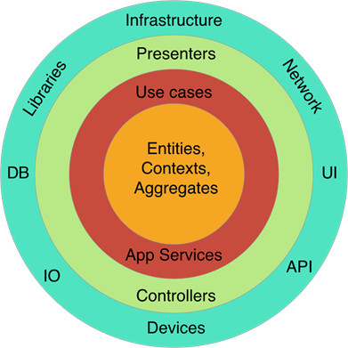

# Summer

:star:基于.net 5的DDD项目结构


**整洁架构(Clean Architecture) / 洋葱架构 示意图：**





---

## Getting started

### 领域层(Domain Layer)

#### 实体(Entity)

```c#
public class OrderItem : BaseEntity
{
     public int ProductId { get; private set; }
    
    // todo:
}
```

#### 值对象(Value Object)

```c#
public class Address : ValueObject
{
    public String Street { get; private set; }
    public String City { get; private set; }
    
    // todo:
}
```

#### 聚合(Aggregate) ，聚合根(Aggregate Root)

```c#
public class Order : BaseEntity, IAggregateRoot
{
    public Address Address { get; private set; }
    
    public int? BuyerId { get; private set; }
    
    private readonly List<OrderItem> _orderItems;
    public IReadOnlyCollection<OrderItem> OrderItems => _orderItems;
    
    // todo:
}
```

#### 仓储(Repository)

`IRepository`泛型仓储，提供了一系列基础方法，配合规约使用。

```c#
public class GetTodoByIdQueryHandler : IRequestHandler<GetTodoByIdQuery, TodoResponse>
{
    private readonly IRepository<Todo> _todoRepository;
    public GetTodoByIdQueryHandler(IRepository<Todo> todoRepository)
    {
        _todoRepository = todoRepository ?? throw new ArgumentNullException(nameof(todoRepository));
    }
    
    public async Task<TodoResponse> Handle(GetTodoByIdQuery request, CancellationToken cancellationToken
    {
        // todo:
        
        // _todoRepository.ListAsync
        // _todoRepository.AddAsync
        // _todoRepository.UpdateAsync
        // _todoRepository.DeleteAsync
        // _todoRepository.GetByIdAsync
        // ......
        
        return response;
    }
}
```

#### 规约(Specification)

使用`ardalis/Specification`实现。

```c#
public sealed class TodoSpec : Specification<Todo>
{
    // 默认
    public TodoSpec()
    {
        Query.OrderByDescending(x => x.Id);
    }
    
    // 支持条件过滤
    public TodoSpec(string filter)
    {
        if (!string.IsNullOrEmpty(filter))
        {
            Query.Where(x => x.Name.Contains(filter));
        }
        Query.OrderByDescending(x => x.Id);
    }
    
    // 支持条件过滤和分页
    public TodoSpec(string filter, int skip, int take)
    {
        if (!string.IsNullOrEmpty(filter))
        {
            Query.Where(x => x.Name.Contains(filter));
        }
        Query.OrderByDescending(x => x.Id).Skip(skip).Take(take);
    }
}
```

使用：

```c#
await _todoRepository.ListAsync(new TodoSpec());
await _todoRepository.ListAsync(new TodoSpec("xx"));
await _todoRepository.ListAsync(new TodoSpec("xx", 0, 10));
```

#### 领域服务(Domain Service)

// todo:

#### 领域事件(Domain Event)

// todo:

#### 业务异常(Business Exception)

// todo:

### 应用层（Application Layer）

#### 命令查询分离(CQRS)

基于`MediatR`实现。

- 以下的 **Handler** 相当于**应用服务(Application Service)**

- **Command**，**Query** 相当于 **输入DTO**

- **Response** 相当于 **输出DTO**

##### Command

```c#
public class CreateTodoCommand : IRequest<TodoResponse>
{
    public string Name { get; set; }
    public string Desc { get; set; }
    
    // todo:
}
```

```c#
public class CreateTodoCommandHandler : IRequestHandler<CreateTodoCommand, TodoResponse>
{
    public async Task<TodoResponse> Handle(CreateTodoCommand request, CancellationToken cancellationToken)
    {
        // todo:
        
        return response;
    }
}
```

```c#
public class TodosController : ControllerBase
{
    private readonly IMediator _mediator;
    public TodosController(IMediator mediator)
    {
        _mediator = mediator;
    }

    [HttpPost]
    [ProducesResponseType(StatusCodes.Status201Created)]
    public async Task<ActionResult<TodoResponse>> CreateTodo(CreateTodoCommand createTodoCommand)
    {
        var response = await _mediator.Send(createTodoCommand);
        return CreatedAtAction(nameof(GetTodo), new {id = response.Id}, response);
    }
}
```

##### Query

```c#
public class GetTodoByIdQuery : IRequest<TodoResponse>
{
    public int Id { get; set; }
}
```

```c#
public class GetTodoByIdQueryHandler : IRequestHandler<GetTodoByIdQuery, TodoResponse>
{
    public async Task<TodoResponse> Handle(GetTodoByIdQuery request, CancellationToken cancellationToken
    {
        // todo:
        
        return response;
    }
}
```

```c#
public class TodosController : ControllerBase
{
    private readonly IMediator _mediator;
    public TodosController(IMediator mediator)
    {
        _mediator = mediator;
    }
    
    [HttpGet("{id:int}")]
    public async Task<ActionResult<TodoResponse>> GetTodo(int id)
    {
        var response = await _mediator.Send(new GetTodoByIdQuery(id));
        return Ok(response);
    }
}
```

#### 权限(Permissions)

使用`[Permission]`标记。

```c#
[Permission(nameof(CreateTodoCommand), "创建Todo", "Todo管理")]
public class CreateTodoCommand : IRequest<TodoResponse>
{
    public string Name { get; set; }
    public string Desc { get; set; }
    
    // todo:
}
```

#### 工作单元(Unit Of Work)

泛型仓储`IRepository`中的`Add`,`Update`,`Delete`等方法默认实现了`UOW`。

也可以将一个`Request`标记为`[UnitOfWork]`，这样会开启事务，保证请求期间的所有操作在一个`UOW`中。

```c#
[UnitOfWork]
public class CreateTodoCommand : IRequest<TodoResponse>
{
    public string Name { get; set; }
    public string Desc { get; set; }
    
    // todo:
}
```

#### 当前用户(Current User)

使用`ICurrentUser`服务。

```c#
public class GetTodoByIdQueryHandler : IRequestHandler<GetTodoByIdQuery, TodoResponse>
{
    private readonly ICurrentUser _currentUser;
    public GetTodoByIdQueryHandler(ICurrentUser<Todo> currentUser)
    {
        _currentUser = currentUser ?? throw new ArgumentNullException(nameof(currentUser));
    }
    
    public async Task<TodoResponse> Handle(GetTodoByIdQuery request, CancellationToken cancellationToken
    {
        // todo:
        
        // _currentUser.IsAuthenticated
        // _currentUser.Id
        // _currentUser.UserName
        // ......
        
        return response;
    }
}
```

#### Request 验证(Validation)

使用`FluentValidation`实现。

```c#
public class CreateTodoCommandValidator : AbstractValidator<CreateTodoCommand>
{
    public CreateTodoCommandValidator()
    {
        RuleFor(x => x.Name).NotEmpty().WithMessage("名称不能为空");
    }
}
```

#### DTO映射(Object Mapping)

使用`AutoMapper`实现。

```c#
public class DomainToResponseProfile : Profile
{
    public DomainToResponseProfile()
    {
        CreateMap<Todo, TodoResponse>();
    }
}
```

```c#
public class GetTodoByIdQueryHandler : IRequestHandler<GetTodoByIdQuery, TodoResponse>
{
    private readonly IMapper _mapper;
    public GetTodoByIdQueryHandler(IMapper mapper)
    {
        _mapper = mapper ?? throw new ArgumentNullException(nameof(mapper));
    }
    
    public async Task<TodoResponse> Handle(GetTodoByIdQuery request, CancellationToken cancellationToken
    {
        // todo:
        
        return _mapper.Map<TodoResponse>(todo);
    }
}
```

## 致敬

- [ardalis/CleanArchitecture: A starting point for Clean Architecture with ASP.NET Core (github.com)](https://github.com/ardalis/CleanArchitecture)

- [ardalis/Specification: Base class with tests for adding specifications to a DDD model (github.com)](https://github.com/ardalis/Specification)
- [dotnet-architecture/eShopOnWeb: Sample ASP.NET Core 5.0 reference application, powered by Microsoft, demonstrating a layered application architecture with monolithic deployment model. Download the eBook PDF from docs folder. (github.com)](https://github.com/dotnet-architecture/eShopOnWeb)
- [dotnet-architecture/eShopOnContainers: Cross-platform .NET sample microservices and container based application that runs on Linux Windows and macOS. Powered by .NET 5, Docker Containers and Azure Kubernetes Services. Supports Visual Studio, VS for Mac and CLI based environments with Docker CLI, dotnet CLI, VS Code or any other code editor. (github.com)](https://github.com/dotnet-architecture/eShopOnContainers)

- [jbogard/MediatR: Simple, unambitious mediator implementation in .NET (github.com)](https://github.com/jbogard/MediatR)

- [AutoMapper/AutoMapper: A convention-based object-object mapper in .NET. (github.com)](https://github.com/AutoMapper/AutoMapper)

- [FluentValidation/FluentValidation: A popular .NET validation library for building strongly-typed validation rules. (github.com)](https://github.com/FluentValidation/FluentValidation)
- [abpframework/abp: Open Source Web Application Framework for ASP.NET Core (github.com)](https://github.com/abpframework/abp)
- [domaindrivendev/Swashbuckle.AspNetCore: Swagger tools for documenting API's built on ASP.NET Core (github.com)](https://github.com/domaindrivendev/Swashbuckle.AspNetCore)

